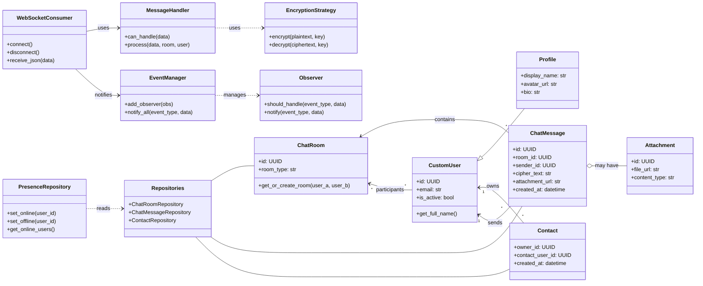
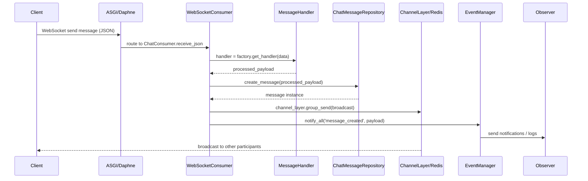

# Chatterly — Diagrams

This file contains GitHub-friendly Mermaid diagrams for the Chatterly chat application. The previous parse error was caused by using `<<interface>>` annotation inside class declarations, which GitHub's Mermaid parser does not accept. The diagrams below avoid that syntax and render correctly on GitHub.

---

## Class Diagram

---

## Sequence Diagram (Message Flow)

---

